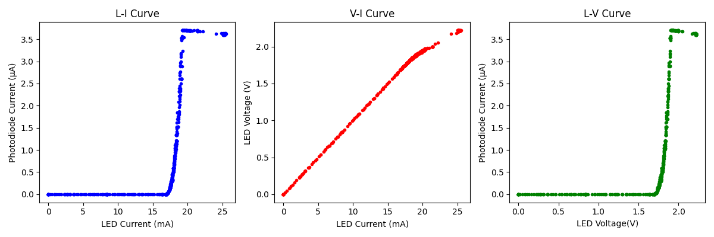

# LED-liv-Characterization-Tool

## Overview
This project is an LED L-I-V (Light-Current-Voltage) characterization tool 
built around an Arduino Uno, a BPW34 photodiode, and an LM358 transimpedance 
amplifier. A potentiometer sweeps current through the LED across its full 
operating range while the Arduino simultaneously measures three parameters: 
LED current via a 100Ω resistor, LED forward voltage from direct analog 
measurement, and optical output power from a photodiodes current amplified through 
the transimpedance amplifier. All three values are logged over serial to a 
Python script that generates L-I, V-I, and L-V characteristic curves.

L-I-V characterization is one of the most fundamental measurements in 
photonics device engineering. These measurements are performed on every  
optical device from LEDs and laser diodes to photodetectors and photonic integrated  
circuits. Understanding how light output, drive current, and forward voltage relate to 
each other is the foundation of optical device design, and the same 
measurement methodology used here scales directly to the silicon photonic 
devices being developed at facilities like AIM Photonics and Lumentum.
## Theory

### Current Measurement from R_1
A 100Ω resistor is placed in series with the LED. The Arduino reads 
the raw ADC value at the junction of the resistor and LED, converts it 
to voltage:

V = ADC × (5.0 / 1023.0)

And calculates current directly from Ohm's law:

I_LED = V / R

### Transimpedance Amplifier (TIA)
The BPW34 photodiode generates a tiny photocurrent proportional to incident 
light intensity. A transimpedance amplifier converts this current to a 
measurable voltage using a feedback resistor R_f:

V_out = I_photo × R_f

The Arduino reads V_out and back-calculates I_photo:

I_photo = V_out / R_f

### What Each Curve Tells You

**L-I Curve (Light vs Current)**
Shows how optical output power scales with drive current. Above the LED's 
threshold current, light output increases linearly with current. The slope 
of this curve is the **slope efficiency**; how many watts of optical power 
per amp of drive current. A steeper slope means a more efficient LED.

**V-I Curve (Voltage vs Current)**
Shows the diode's non-linear electrical behavior. Below the forward voltage 
threshold the LED barely conducts. Above it, voltage rises steeply then 
flattens while current continues to increase, the classic diode I-V 
characteristic described by the Shockley equation. The knee of this curve 
is the forward voltage V_f.

**L-V Curve (Light vs Voltage)**
Combines the other two. Shows how light output relates to forward voltage. 
Useful for system design where voltage rather than current is the controlled 
variable. The threshold behavior of the LED is clearly visible as a sharp 
turn-on point.
## Hardware 
- Arduino Uno R3
- Breadboard and Jumper Wires
- 10kΩ Potentiometer
- 100Ω Resistor
- 1MΩ Resistor
- Red LED
- LM358 Op-Amp
- BPW34 Photodiode
  
## Software

### Arduino Sketch
Reads three analog voltages simultaneously; the junction of the sense 
resistor and LED anode (A0), the LED cathode (A1), and the TIA output (A2). 
Calculates LED current in milliamps (I = V_A0 / 100), LED forward voltage 
in volts (V_LED = V_A0 - V_A1), and photodiode current in microamps 
(I_photo = V_A2 / 1,000,000). Transmits all three values over serial at 
9600 baud every 100ms.

### Python Script
Establishes a serial connection with the Arduino and continuously reads 
LED current, LED voltage, and photodiode current into three lists until 
interrupted with Ctrl+C. Upon termination generates three side-by-side 
subplots:
- **L-I curve** — photodiode current vs LED current
- **V-I curve** — LED voltage vs LED current  
- **L-V curve** — photodiode current vs LED voltage

**Libraries used:**
- pyserial — serial communication with Arduino
- matplotlib — data plotting and subplot generation
- time — serial connection delay on startup

## Results

Testing was preformed in low ambient light conditions (night) to minimize photodiode noise floor interference. The potentiometer was swept slowly from minimum to maximum current while the Python script logged all three parameters simultaneously.

 
(1302 readings)

 **L-I Curve:** Light output remained near zero until a threshold current of **17.068mA**, after which photodiode current increased sharply before saturating near the LED's maximum drive current. This threshold behavior is characteristic of all LED and laser diode devices, below threshold recombination is primarily non-radiative; above it, stimulated and spontaneous emission dominate.

**V-I Curve:** Forward voltage increased linearly with current from 0 to **2.05V**, consistent with the Shockley diode equation. A slight tapering of the slope at higher currents is noticeable, a real-world deviation from ideal diode behavior caused by series resistance and high-injection effects at elevated current densities

 **L-V Curve:** Light output remained near zero until a threshold forward voltage of **1.71V**, after which optical output increased sharply, directly mirroring the threshold behavior seen in the L-I curve. This threshold voltage represents the minimum forward bias required to achieve significant radiative recombination in the LED junction.

Together the three curves fully characterize the LED's electro-optical behavior. The L-I curve quantifies efficiency, the V-I curve characterizes electrical behavior, and the L-V curve ties optical output directly to the device's bias conditions.
## How to Run

## Limitations
